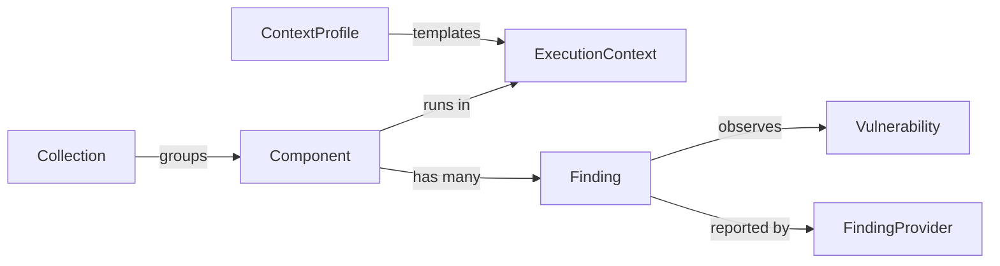

# Ubiquitous Language

## Purpose

This is the canonical domain vocabulary for VENOM.

Rules:

- keep it compact;
- update it when domain understanding changes;
- use these terms consistently in code, tests, docs, and conversations.

## Domain model overview

## Glossary

| Term | Kind | Definition | Avoid |
|---|---|---|---|
| Classification | process | The act of deciding how a finding should be treated in context. | generic "triage" when a domain state change is meant |
| Collection | entity | A named grouping of components managed as one scope. | "group", "universe" as the default term |
| Component | entity | A software asset under management, such as a container image, package set, or other scan target. | "asset" as the primary domain term |
| Context Profile | entity | A reusable template of execution-context information. | "preset" as the canonical domain name |
| Execution Context | value object | The runtime and business context that changes how a finding should be interpreted. | "environment" when the richer domain meaning is intended |
| Finding | entity | A concrete observation of a vulnerability affecting a specific component and artifact. | "issue", "alert", "hit" |
| Finding Provider | port | A provider-specific source of findings mapped into VENOM's canonical finding model. | provider schema names as domain terms |
| Risk Acceptance | decision | A classification outcome that explicitly accepts a finding's risk for a bounded period or scope. | "ignore" |
| Scan | process | The act of asking a finding provider for the current findings of a component or scope. | "sync" when scan semantics are intended |
| Suppression | decision | A classification outcome that hides a finding from normal operational attention under explicit rationale. | "mute" |
| Vulnerability | entity | The canonical vulnerability or advisory that may be observed across many findings. | "CVE" as a universal synonym |

## Update rule

Every wave must declare one of:

- `Language impact: none`
- `Language impact: add`
- `Language impact: change`
- `Language impact: remove`

If the impact is not `none`, this file must be updated in the same wave.
