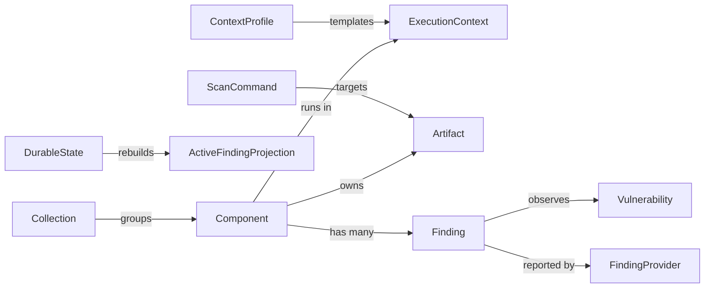

# Ubiquitous Language

## Purpose

This is the canonical domain vocabulary for VENOM.

Rules:

- keep it compact;
- update it when domain understanding changes;
- use these terms consistently in code, tests, docs, and conversations.

## Domain model overview

## Glossary

| Term | Kind | Definition | Avoid |
|---|---|---|---|
| Artifact | value object | An immutable scan subject identity, such as an image digest or SBOM digest, that a provider observed. | mutable tags as the primary identity |
| API Read Snapshot | value object | A refreshed read-only snapshot that serves operator-facing API queries without borrowing the mutable write service directly. | read endpoints coupled to the write lock path |
| Active Finding Projection | read model | A rebuildable operator-facing view of the findings currently active for one component and one artifact. | treating transient in-memory state as the source of truth |
| Read Model | model role | A rebuildable query-oriented model shaped for one operator or integration view rather than for durable business mutation. | directly reusing mutable write state as the default query shape |
| Release Dashboard | read model | One executive operator-facing view that aggregates managed release collections, schedule state, collection health, and elevated contextual risk into one compact release board. | treating collection list payloads as a dashboard by accident |
| Classification | process | The act of deciding how a finding should be treated in context. | generic "triage" when a domain state change is meant |
| Collection | entity | A closed explicit grouping of managed components operated as one release or platform scope. | "group", "universe" as the default term |
| Component Tag | entity | A reusable transversal cohort of managed components that can span many release collections and drive bulk actions or context overlays. | treating free-form labels as if they had no domain semantics |
| Collection Source | value object | One declared source definition that VENOM can materialize into collection membership with explicit `replace` or `reconcile` semantics. | ad hoc client-side loops that mutate collection membership implicitly |
| Collection Health | read model | A compact operator-facing summary of one collection's active findings, governance distribution, and elevated contextual risk counts. | reconstructing release health manually from raw findings tables |
| Collection Governance Overview | read model | One release-scoped operator workbench that combines the collection health summary with one filtered page of active findings from the same collection scope. | splitting collection health context away from the findings view the operator is currently governing |
| Collection Default Context | relationship | One managed context profile attached to one release collection as a scoped default overlay, used only when evaluating members inside that collection scope. | treating release defaults as global component context |
| Tag Context Overlay | relationship | One managed context profile attached to one component tag as a reusable partial overlay that applies across tagged components unless a more specific component field is defined. | letting multiple tags silently override each other without conflict rules |
| Collection-Scoped Context Action | process | One explicit operator action that sets or changes one managed collection default context without fan-out writes to every member. | client-side loops that assign context profile member by member |
| Tag-Scoped Context Action | process | One explicit operator action that sets or changes one managed tag context overlay for all tagged components without per-component fan-out writes. | mutating each tagged component one by one from the client |
| Bulk Governance Action | process | One explicit operator decision applied to one filtered open cohort of findings inside one release scope. | hidden fan-out over an implicit or paged result set |
| Tag-Scoped Bulk Governance Action | process | One explicit operator decision applied to one filtered open cohort of findings across one reusable component-tag scope. | deriving the target set from visible UI rows or from one release only |
| Bulk Governance Cohort | read model | One release-scoped summary of the currently targetable open findings cohort for one bulk governance action, independent from the current findings page size. | deriving bulk-action scope from the visible page only |
| Collection Scan | process | The act of expanding one closed collection into canonical scan requests for each currently owned immutable artifact of each collection member. | implicit ad hoc loops over components |
| Collection Scan Schedule | value object | The durable periodic cadence and freshness mode attached to one managed collection, including the next due time for one explicit scheduler pass. | hidden background timers with no durable state |
| Source Materialization | process | The explicit durable act of applying one declared collection source into one collection's concrete membership. | silent background reconciliation with no observable operator outcome |
| Component | entity | A software asset under management, such as a container image, package set, or other scan target. | "asset" as the primary domain term |
| Context Profile | entity | A reusable template of execution-context information. | "preset" as the canonical domain name |
| Effective Context | value object | The merged execution context that actually applies to one component in one query scope after precedence rules are applied across component, tag, and collection overlays. | pretending one scope with multiple overlays still has a single profile identity |
| Context Provenance | projection field | The truthful set of context-profile sources that contributed to one effective context, preserving whether the result came from component, tag, collection, or a composite of them. | collapsing multi-source context into one fake profile key |
| Context Factor Provenance | projection field | The truthful source of each individual effective context trait after overlay precedence is applied, such as `production:true` from `collection` or `vpn-restricted:true` from `tag`. | forcing operators to infer per-factor origin from whole-profile labels |
| Contextual Risk | projection field | The deterministic operator-facing risk level produced by combining raw finding severity with one effective context. | treating raw severity as the final operational priority |
| Durable State | boundary | The append-only durable history and rebuildable in-memory state that preserves managed ownership and provider observations across reloads. | assuming current memory is enough for business truth |
| Execution Context | value object | The runtime and business context that changes how a finding should be interpreted. | "environment" when the richer domain meaning is intended |
| Finding | entity | A concrete observation of a vulnerability affecting a specific component and artifact. | "issue", "alert", "hit" |
| Finding Decision | value object | One explicit durable governance outcome that VENOM attaches to one canonical finding, such as a risk acceptance or suppression. | ad hoc UI-only flags |
| Finding Provider | port | A provider-specific source of findings mapped into VENOM's canonical finding model. | provider schema names as domain terms |
| Finding Reference | value object | The canonical identity of one finding in one component and immutable artifact scope, used to attach durable governance decisions. | transient row ids as the source of truth |
| Integration Event | value object | A canonical external event that VENOM makes available after a durable domain change becomes publishable outside the core. | broker payload shape as the domain term |
| Integration Runtime Configuration | value object | The durable system-level configuration that tells VENOM which integration publisher implementation it should use, and with which minimal delivery parameters. | choosing the integration publisher ad hoc per drain request |
| Managed Artifact | relationship | An explicit ownership binding between a managed component and an immutable artifact identity. | assuming a report artifact belongs to a component without registration |
| Outbox Record | durable record | One durably stored integration event that is pending or already published, coordinated with the business write that created it. | publishing directly from transient in-memory state |
| Publication Attempt | process | One bounded attempt to publish pending outbox records and persist the outcome explicitly. | hidden background retries with no durable trace |
| Provider Runtime Configuration | relationship | The durable binding that tells VENOM which provider implementation one managed component should use when executing scans. | choosing the provider ad hoc in a worker request payload |
| Provider Scan Report | value object | A complete provider snapshot of findings for one component and one immutable artifact at one observation time. | provider webhooks or scanner payloads as domain terms |
| Reopen | decision lifecycle step | The explicit durable act of removing one prior governance decision so the finding returns to the canonical `open` state. | mutating findings away or treating reopen as a hidden UI-only flag reset |
| Scan Command | command | A durably queued request for one canonical scan that must end in an explicit terminal state such as completed or failed. | hidden background work or implicit retries |
| Scan Execution | process | The act of executing one canonical scan request through a provider and applying the resulting provider scan report. | direct scanner details as the domain term |
| Scan Request | value object | A canonical request for a provider scan over one managed component, one owned immutable artifact, and one freshness mode. | ad-hoc scanner invocation details as the domain term |
| Risk Acceptance | decision | A classification outcome that explicitly accepts a finding's risk for a bounded period or scope. | "ignore" |
| Scan | process | The act of asking a finding provider for the current findings of a component or artifact scope. | "sync" when scan semantics are intended |
| System Event Trace | read model | One rebuildable, operator-facing recent timeline over scheduler, command, governance, and publication activity. | inferring operator history from unrelated status endpoints |
| Suppression | decision | A classification outcome that hides a finding from normal operational attention under explicit rationale. | "mute" |
| Vulnerability | entity | The canonical vulnerability or advisory that may be observed across many findings. | "CVE" as a universal synonym |
| Write Model | model role | The durable business state and mutation logic that owns correctness, invariants, and explicit command outcomes. | using projection or UI convenience shape as the source of truth |

## Update rule

Every wave must declare one of:

- `Language impact: none`
- `Language impact: add`
- `Language impact: change`
- `Language impact: remove`

If the impact is not `none`, this file must be updated in the same wave.
